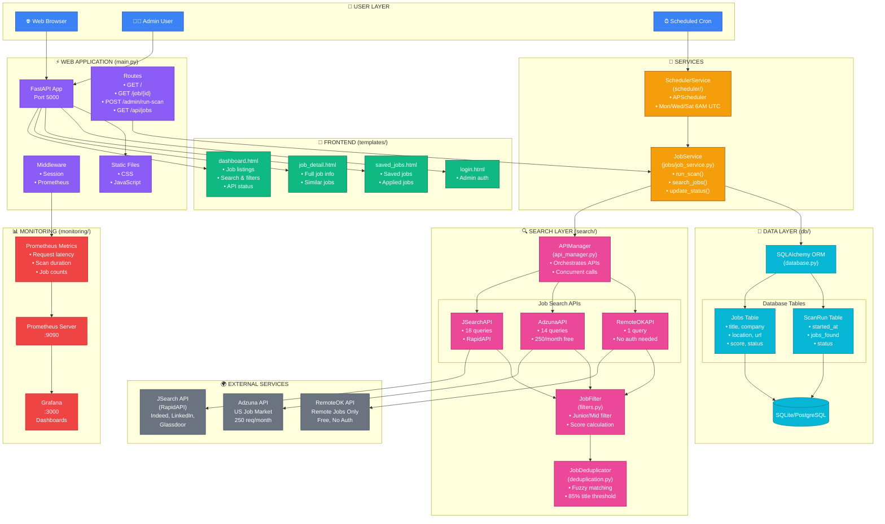
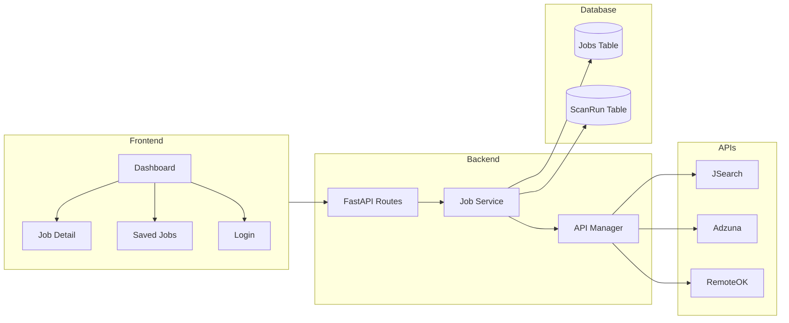
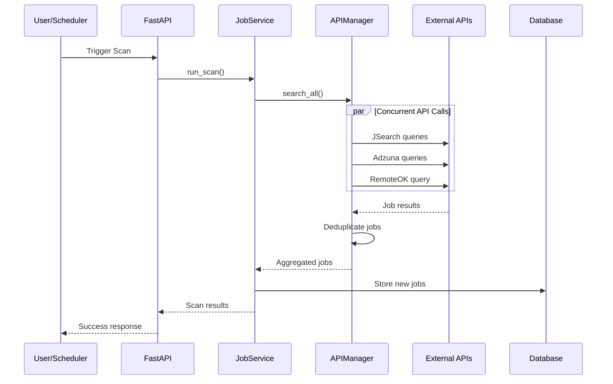

# IAM Job Scout - Architecture Guide

This document describes the system architecture and provides diagrams you can use or recreate.

## System Overview

IAM Job Scout is a multi-API job aggregation platform built with FastAPI. It searches multiple job APIs, deduplicates results, and presents them through a web dashboard.

---

## Complete System Architecture (Single View)

**Copy this Mermaid code into your README.md - GitHub will render it automatically:**



## Component Diagram (Mermaid)



## Data Flow Diagram (Mermaid)



## ASCII Diagram

For environments that don't support Mermaid:

```
┌─────────────────────────────────────────────────────────────────────────┐
│                              CLIENT LAYER                                │
│                           ┌─────────────┐                               │
│                           │ Web Browser │                               │
│                           └──────┬──────┘                               │
└──────────────────────────────────┼──────────────────────────────────────┘
                                   │
┌──────────────────────────────────┼──────────────────────────────────────┐
│                              WEB LAYER                                   │
│  ┌─────────────┐  ┌─────────────┴─────────────┐  ┌─────────────────┐   │
│  │   Static    │  │     FastAPI Application    │  │   Prometheus    │   │
│  │  (CSS/JS)   │  │  ┌─────────────────────┐  │  │    Metrics      │   │
│  └─────────────┘  │  │  Jinja2 Templates   │  │  └─────────────────┘   │
│                   │  └─────────────────────┘  │                         │
│                   └─────────────┬─────────────┘                         │
└─────────────────────────────────┼───────────────────────────────────────┘
                                  │
┌─────────────────────────────────┼───────────────────────────────────────┐
│                           SERVICE LAYER                                  │
│       ┌─────────────────────────┴─────────────────────────┐             │
│       │                    JobService                      │             │
│       └─────────────────────────┬─────────────────────────┘             │
│                                 │                                        │
│       ┌─────────────────────────┴─────────────────────────┐             │
│       │              SchedulerService (APScheduler)        │             │
│       │           (Mon/Wed/Sat @ 6:00 AM UTC)             │             │
│       └───────────────────────────────────────────────────┘             │
└─────────────────────────────────┬───────────────────────────────────────┘
                                  │
┌─────────────────────────────────┼───────────────────────────────────────┐
│                           SEARCH LAYER                                   │
│                   ┌─────────────┴─────────────┐                         │
│                   │        APIManager          │                         │
│                   └─────────────┬─────────────┘                         │
│         ┌───────────────────────┼───────────────────────┐               │
│         │                       │                       │               │
│  ┌──────┴──────┐  ┌─────────────┴───────────┐  ┌───────┴───────┐       │
│  │  JSearchAPI │  │       AdzunaAPI         │  │  RemoteOKAPI  │       │
│  │  (18 queries)│  │      (14 queries)       │  │  (1 query)    │       │
│  └──────┬──────┘  └─────────────┬───────────┘  └───────┬───────┘       │
│         │                       │                       │               │
│         └───────────────────────┼───────────────────────┘               │
│                   ┌─────────────┴─────────────┐                         │
│                   │     JobDeduplicator       │                         │
│                   │   (Fuzzy matching)        │                         │
│                   └───────────────────────────┘                         │
└─────────────────────────────────┬───────────────────────────────────────┘
                                  │
┌─────────────────────────────────┼───────────────────────────────────────┐
│                            DATA LAYER                                    │
│                   ┌─────────────┴─────────────┐                         │
│                   │     SQLAlchemy ORM        │                         │
│                   └─────────────┬─────────────┘                         │
│                   ┌─────────────┴─────────────┐                         │
│                   │  ┌─────┐ ┌───────┐ ┌────┐ │                         │
│                   │  │Jobs │ │ScanRun│ │... │ │                         │
│                   │  └─────┘ └───────┘ └────┘ │                         │
│                   │    SQLite / PostgreSQL    │                         │
│                   └───────────────────────────┘                         │
└─────────────────────────────────────────────────────────────────────────┘
                                  │
┌─────────────────────────────────┼───────────────────────────────────────┐
│                         EXTERNAL SERVICES                                │
│    ┌────────────────┐  ┌────────────────┐  ┌────────────────┐          │
│    │    JSearch     │  │     Adzuna     │  │    RemoteOK    │          │
│    │   (RapidAPI)   │  │   (Free Tier)  │  │   (Free API)   │          │
│    │ Indeed,LinkedIn│  │  250 req/month │  │  No Auth Req   │          │
│    └────────────────┘  └────────────────┘  └────────────────┘          │
└─────────────────────────────────────────────────────────────────────────┘
```

## Directory Structure

```
iam-job-scout/
├── main.py                 # FastAPI application entry point
├── db/
│   ├── database.py         # SQLAlchemy setup
│   └── models.py           # ORM models (Job, ScanRun, Settings)
├── jobs/
│   └── job_service.py      # Business logic for jobs
├── search/
│   ├── api_manager.py      # Orchestrates all APIs
│   ├── jsearch.py          # JSearch/RapidAPI integration
│   ├── adzuna.py           # Adzuna API integration
│   ├── remoteok.py         # RemoteOK API integration
│   ├── deduplication.py    # Fuzzy duplicate detection
│   └── filters.py          # Job filtering logic
├── scheduler/
│   └── scheduler_service.py # APScheduler setup
├── monitoring/
│   ├── metrics.py          # Prometheus metrics
│   └── db_metrics.py       # Database metrics
├── templates/              # Jinja2 HTML templates
├── static/                 # CSS, JS, images
└── tests/                  # Pytest test suite
```

## Tools to Create Diagrams

### 1. draw.io (Recommended - Free)
- Website: https://draw.io or https://app.diagrams.net
- Export as PNG/SVG for README
- Can import from Mermaid

### 2. Lucidchart
- Website: https://lucidchart.com
- Professional diagrams
- Free tier available

### 3. Excalidraw (Hand-drawn style)
- Website: https://excalidraw.com
- Creates informal, sketch-like diagrams
- Great for presentations

### 4. Mermaid Live Editor
- Website: https://mermaid.live
- Paste the Mermaid code above
- Export as PNG/SVG

### 5. PlantUML
- Website: https://plantuml.com
- Text-based diagrams
- Good for sequence diagrams

## Color Scheme Suggestions

For a professional look, use these colors:

| Component | Color | Hex Code |
|-----------|-------|----------|
| Client/UI | Blue | #3B82F6 |
| API Layer | Green | #10B981 |
| Services | Purple | #8B5CF6 |
| Database | Orange | #F59E0B |
| External APIs | Gray | #6B7280 |
| Monitoring | Red | #EF4444 |

## Key Architectural Decisions

1. **Multi-API Strategy**: Uses 3 job APIs to maximize coverage and reduce single-point-of-failure risk

2. **Async Processing**: All API calls are async with concurrent execution for performance

3. **Fuzzy Deduplication**: Uses SequenceMatcher for ~85% title and ~80% company similarity matching

4. **Rate Limiting**: Built-in delays between API calls to respect rate limits

5. **Caching**: In-memory caching for stats and locations (5-minute TTL)

6. **Scheduled Scans**: APScheduler runs scans on configurable days/times

7. **Monitoring**: Prometheus metrics for observability

## API Flow Summary

```
User Request → FastAPI → JobService → APIManager
                                          ↓
                              ┌───────────┼───────────┐
                              ↓           ↓           ↓
                          JSearch     Adzuna     RemoteOK
                              ↓           ↓           ↓
                              └───────────┼───────────┘
                                          ↓
                                   Deduplicate
                                          ↓
                                   Filter Jobs
                                          ↓
                                   Store in DB
                                          ↓
                                   Return Results
```
